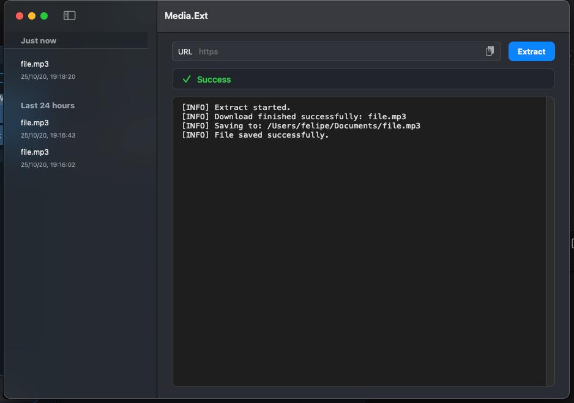

# Media.Ext (Mac)

<p align="center">
  
</p>

<b>Media.Ext</b> lets you extract and download media from the web as easily as possible — with a clean, native macOS interface.

## About

### Features

🧩 Native and modern macOS look & feel — built with PyObjC for great system integration

⚙️ Powerful backend — uses yt-dlp and FFmpeg under the hood

🎞️ Supports a wide range of media sites (anything yt-dlp can handle)

💾 Automatic file naming

🚀 Lightweight & fast, no extra dependencies beyond what you need

### Tech Stack

- Language: Python 3
- Framework: PyObjC
- Backend tools: yt-dlp, FFmpeg

### Screenshots



## Run locally

### Install dependencies

```sh
pip install -r requirements.txt
```

### Run (dev)

```sh
python app.py
```

## Run release

### Build .app

```sh
source ./build.sh
```
